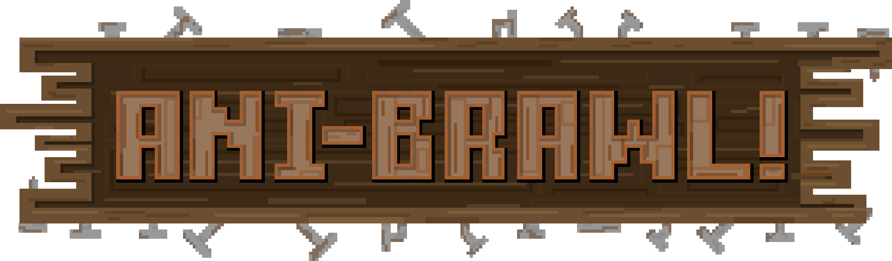

# AniBrawl!

When humans leave to the city, the farm awakes. Play as a farm animal and have an afternoon full of fun and violence with your friends!
With different weapons to choose from, throw and hit at ease, let your inner animal out.

This is a game (still in development) developed by students from <a href="https://www.imagecampus.edu.ar/">Image Campus</a>

   

## Credits

- **Iñaki Diez Galarza** - *Programming*
- **Romina Almendra** - *Art*
- **Franco Guerra** - *Art*
- **Martín Santini Tiralli** - *Art*
- **Federico Céspedes** - *Audio*
- **Tomás Guida** - *Audio*
- **Pilar Hidalgo López** - *Audio*
- **Martín Caro** - *Testing*
- **Cristian Medina** - *Testing*
- **Ignacio Pagani** - *Testing*
- **Jorge Vassallo** - *Testing*

This game was also possible thanks to the support of these professors:

- **Sergio Baretto**
- **Federico Barra**
- **Jorge Cuéllar**
- **Fernando Puig**
- **Eugenio Taboada**

## Acknowledgements

## Links

Download it from itch.io: <a href="https://anibrawl.itch.io/anibrawl">AniBrawl</a>
